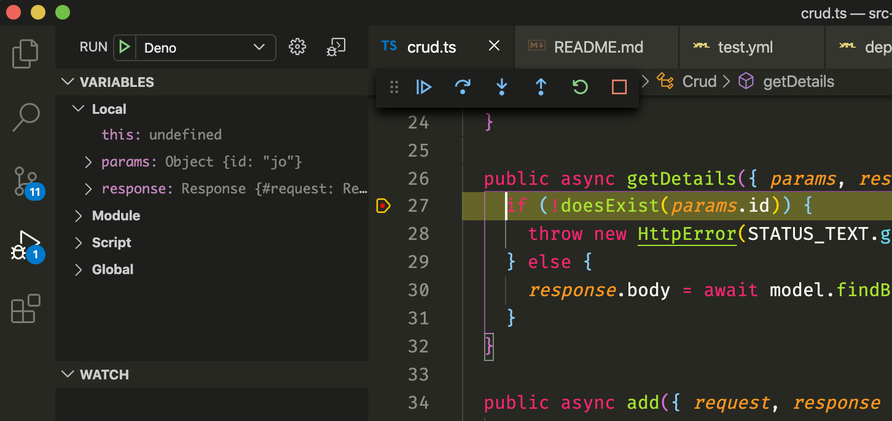

# src-ctt-server


## TODO

- Déploiement après validation CI d'un merge PR
- documentation UI

### Call2Text server

Le projet est fait sur `deno` un équivalent de `node` en mieux et intégrant directement typescript.

L'objectif est de ne plus avoir de node_modules, de fournir un runtime plus secure et rapide.

C'est tout bénef pour vous vu que l'on apprend une méthode qui risque d'être beaucoup utilisée dans les entreprise d'ici quelques années.

# Projet

1. Installer l'exe `deno`

**Mac / Linux:**

```
curl -fsSL https://deno.land/x/install/install.sh | sh
```

**Windows (Powershell):**

```
iwr https://deno.land/x/install/install.ps1 -useb | iex
```

> !! Installer aussi denon si jamais vous voulez watch les changements de fichier et reload le serveur
`deno install --allow-read --allow-run --allow-write -f --unstable https://deno.land/x/denon/denon.ts`

## Extensions à configurer

Installez et activez bien les extensions vscode dans le dossier `.vscode/.extensions.json`.

On rend le dev avec deno plus confortable

use **npm**:

`npm install --save-dev typescript-deno-plugin typescript`

or use **yarn**:

`yarn add -D typescript-deno-plugin typescript`

2. Lancer le Serveur

`make start` ou `make debug`

3. En debug : **Le top**



# Philosophie

On reprend le patron MVC pour organiser le projet tout en mixant avec de l'organisation en nom de domaine. (Par example `transcript` est un domaine)

Voici un aperçu de l'organisation :

```
├── app.ts : fichier d'entrée pour le serveur
├── env.ts : Récupères des variable d'env
├── config : Variables de configuration
│   ├── initDb (ORM)
│   ├── openapi
│   ├── jwt
│   └── container (Alausor)
├── hooks : Code sur certaines requètes / controller
│   └── auth (bloque l'accès si pas de token)
├── middlewares : Placer du code entre chaques requètes
│   └── log
├── areas
│   ├── transcriptArea
│   │   └── Controller
│   └── authArea
│       --> JWT / bcrypt
├── model (= entités)
│   ├── index.ts --> renvoyé toutes les entités
│   ├── transcript.ts
│   └── user.ts
├── modules
│   ├── data : opérations diverses
│   ├── websocket (ws)
│   └── ... modules à réutiliser
├── repo : Opérations complexes BDD
│   ├── transcriptRepo.ts
│   └── userRepo.ts
```

Des fichiers `index.ts` peuvent être placés à la racine de chaque dossier pour récupérer des variables / fonctions / classes / interfaces et les exporter pour les réutiliser plus facilement.

# Style de code

On essaie de suivre ce guide pour pas mettre du code poubelle. Petit projet ne veut pas dire apprendre à mal coder.

[Guide pour un code propre](https://github.com/goldbergyoni/nodebestpractices)

# Librairies Deno utilisés

- ORM : [deno db](https://github.com/eveningkid/denodb)
- Framework web : [Alausor](https://github.com/alosaur/alosaur)
- Validation Schema API : [Jbq](https://github.com/krnik/jbq/tree/master)

# Base de donnée

Base de donnée mysql 8 à installer en local

1. Pour lancer une base de donnée en local

- Installer mysql 8 Server
  [Procédure](https://dev.mysql.com/doc/mysql/en/windows-installation.html)

Ou utiliser le mysql 8 server de wamp / xamp

- Lancer le script de création avec
  > **[Attention]** : Vos identifiants mysql peuvent changer

```sh
mysql -u root -proot < mysql/init.sql
```

pour créer la base et l'utilisateur correspondant et puis **`make schema`**

2. Erreur possible

[Pb de plugin de connection](https://stackoverflow.com/questions/51179516/sequel-pro-and-mysql-connection-failed)

# Ui

On sépare dans ce projet complètement l'interface du back end pour rester sur une utilisation simple des microservices dans l'UI

Suivre ce lien vers le repo [src-ctt-ui](https://github.com/g4-dev/src-ctt-ui)

# Déploiement

Par la CI la commande `make deploy` permet de déployer l'application [ici](http://pandemik699.alwaysdata.net/)

# FAQ

**La génération openapi ne fonctionne pas ?**

Il faut remplacer les retour de la [classe](src/config/openapi.ts) `AlosaurOpenApiBuilder` comme

`public addTitle(title: string): AlosaurOpenApiBuilder`

à remplacer par

`: AlosaurOpenApiBuilder<T>`
